# Visuals — the command center, stage by stage

Fourteen diagrams, one per concern. Read top to bottom for the full picture, or jump to the stage you're setting up. These render on GitHub, in VS Code (Mermaid preview), and at mermaid.live.

---

## 1. Top-level architecture — what runs where

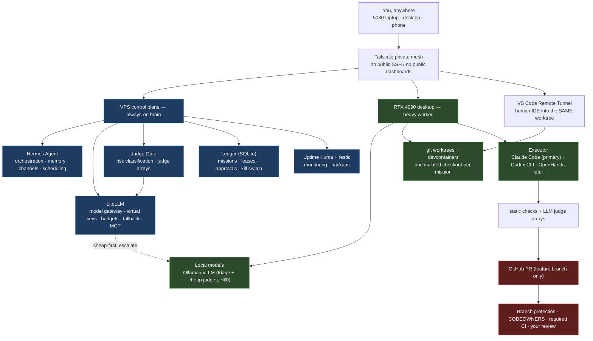

**Read it as:** the brain (blue) is always up on a cheap VPS; the muscle (green) is your 4090, reached privately; GitHub (red) is the wall the agent can prepare work against but never cross alone.

---

## 2. Config contract flow — why it's hard to break

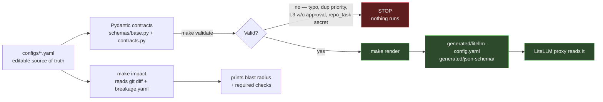

**The guarantee:** a bad edit fails at `make validate`, not at 2am. Tested invariants that get rejected: unknown keys, duplicate model priorities, two canaries in one role, `canary_weight` outside 0–1, missing risk tiers, L3/L4 without approval, and any `repo_task` that's persistent or holds secrets.

---

## 3. Environment map — one environment per activity

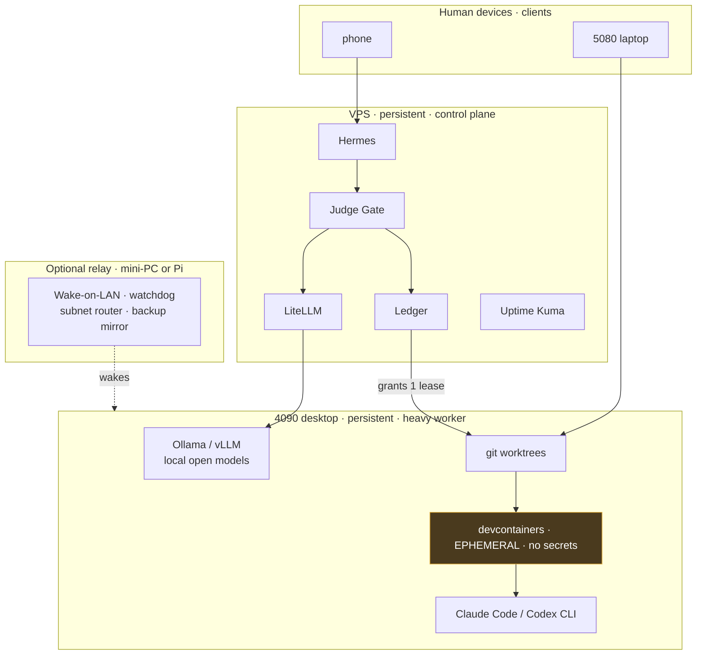

**Isolation invariant (enforced by the contract):** the `repo_task`/devcontainer environment (amber) is ephemeral and holds **no secrets**. That's what keeps one mission from contaminating another or leaking credentials into a sandbox.

---

## 4. Mission lifecycle — every request, same gates

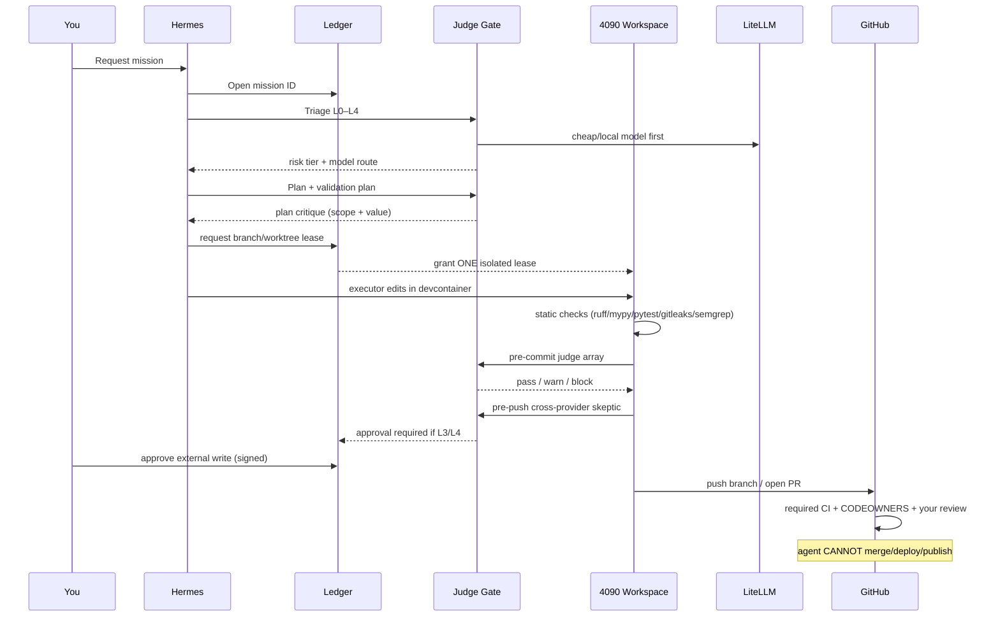

**The principle:** deterministic checks before LLM judges (cheaper, less ambiguous), and a human gate before anything leaves the sandbox.

---

## 5. Risk tiers — what's allowed to be automatic

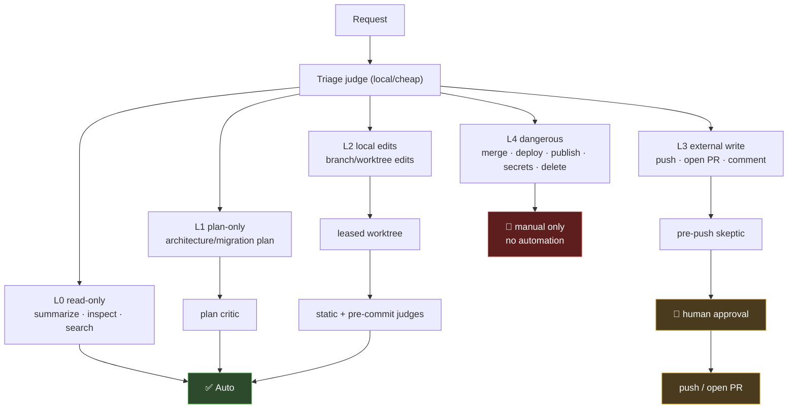

Hard rule: **full power inside the sandbox, narrow audited power outside it.** L3/L4 *cannot* be configured to skip approval — the contract rejects it.

---

## 6. Judge arrays — cheap-first, cross-provider

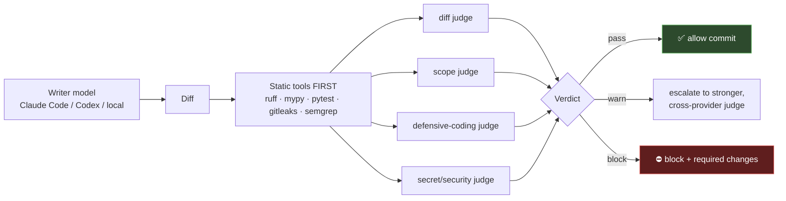

**Cross-provider rule:** whatever family *wrote* the code, a *different* family reviews it (Claude writes → GPT reviews, and vice-versa). The **defensive-coding judge** blocks bloat — swallowed exceptions, redundant guards, hardcoded fallbacks where data-driven values belong, dead flags, fake retries, out-of-scope rewrites — while allowing legitimate boundary validation and clear error propagation.

---

## 7. Model update flow — no auto-promotion

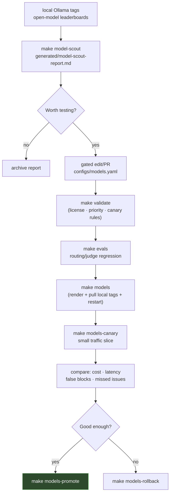

**Updating the system = report → YAML edit → evals → canary.** Local picks (on the 4090): `qwen3-coder:30b`, `qwen3:30b`, `devstral:24b`. Provider routes are contract-forbidden in LiteLLM roles. `scout.propose_only: false` fails validation.

---

## 8. First-boot build flow — the order that actually works

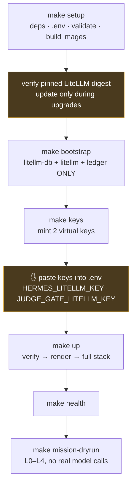

**Why `bootstrap` before `up`:** hermes reads its model key from `.env`, but that key doesn't exist until LiteLLM is running and `make keys` mints it. `bootstrap` starts just the infra so you can mint keys first; `up` then brings up the full stack with keys in place. The two amber steps are the only manual ones.

---

## Phase roadmap (the whole build, one picture)

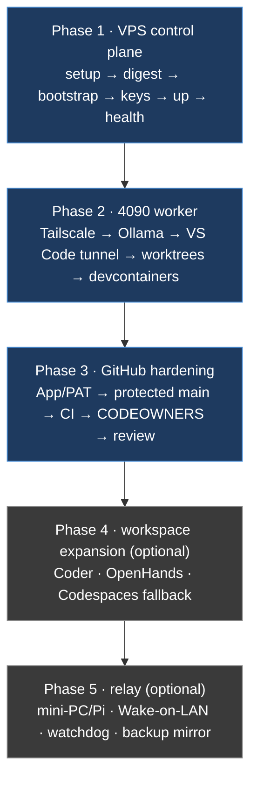

Phases 1–3 are the real system (blue). Phases 4–5 are optional (grey) — add only when you hit a need they solve.

---

## 10. Per-stage model & judge routing (tier-colored)

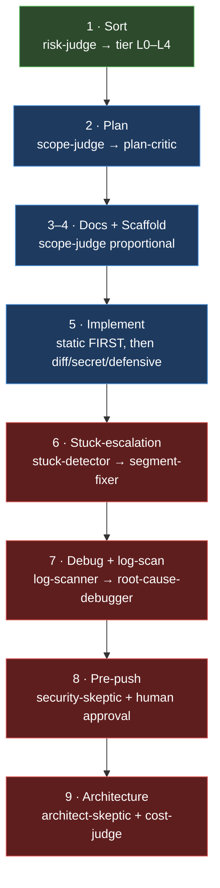

Green = local/free (4090), blue = mid cloud (Sonnet/GPT-5.4), red = heavy frontier (Opus/GPT-5.5). Money is only spent climbing when a cheaper judge can't clear the call. Stages 6–7 are where cheap models would otherwise degrade the codebase silently — a frontier model takes the stuck segment, fixes it correctly, then the pipeline continues. Full detail in `docs/MASTER.md` §5.

---

## 11. Proactive ops lane (watching already-done work)

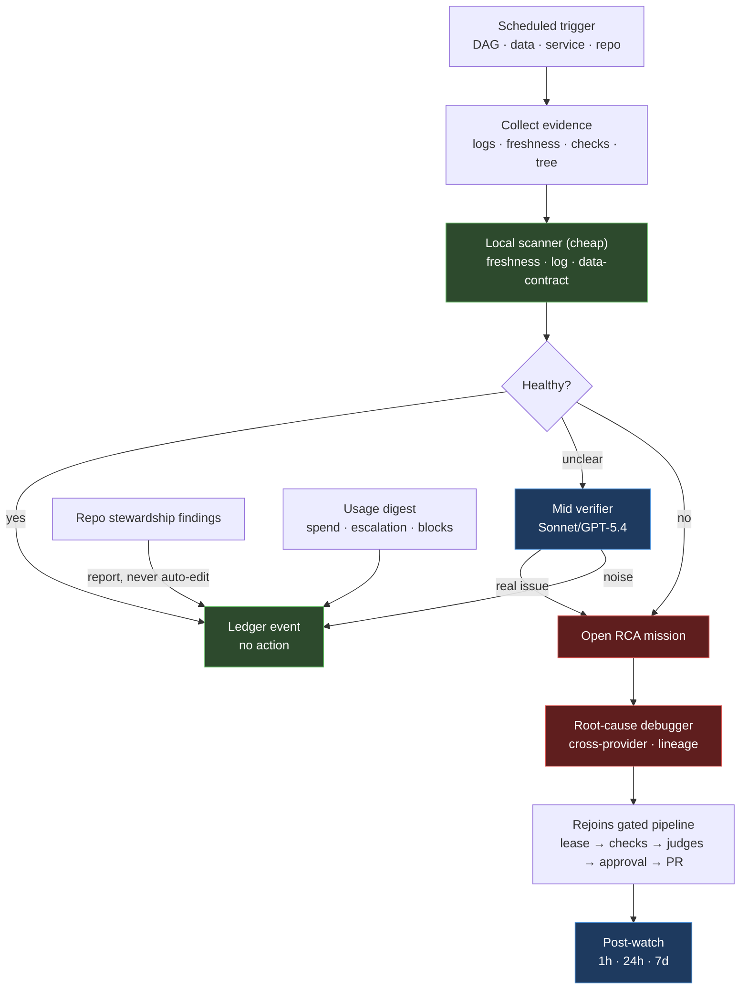

A scheduled check observes, classifies, and at most opens a gated mission — it never edits directly. Healthy → benign ledger event. Unclear → cheap escalation to a mid verifier. Real problem → RCA mission that rejoins the same lease/checks/judges/human-gate pipeline as any other work. Repo-stewardship findings become reports (capped at L2, never an auto-edit). Usage digest summarizes LiteLLM spend and Ledger activity. Full detail in `docs/proactive-ops.md`; config in `configs/proactive.yaml`.

---

## 12. Ten-config contract flow (with standards)

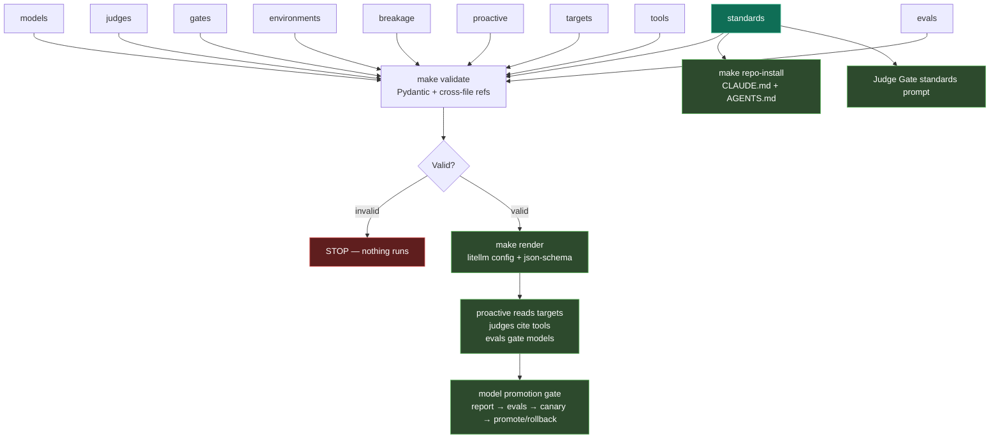

Teal = `standards.yaml`, the durable operating contract for Claude Code, Codex, and Judge Gate. All thirteen configs validate through Pydantic plus a cross-file linter. The contract model is unchanged — standards, model scouting, usage digest, and skill-update caps are data-driven additions, not new architecture. Detail in `docs/MASTER.md`.

---

## 13. Ecosystem layers (what's load-bearing vs convenience vs skip)

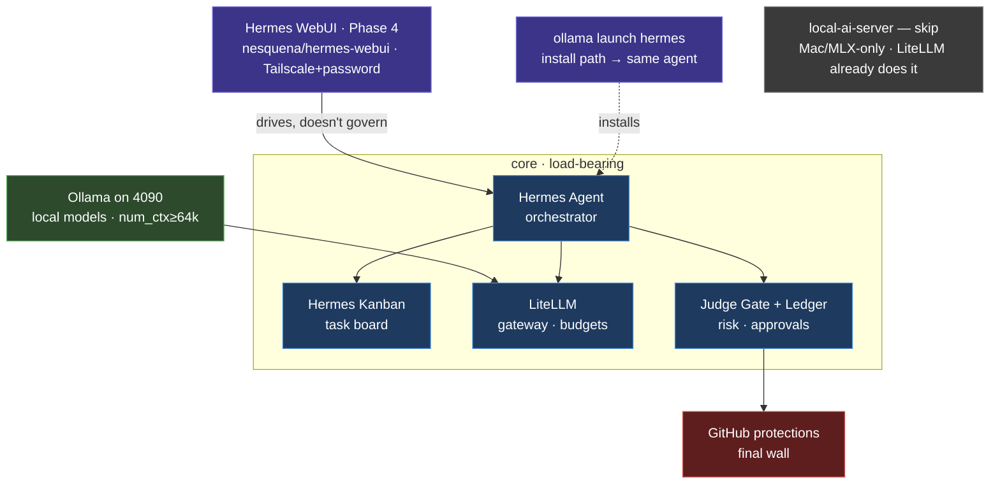

Blue = core (load-bearing). Green = local runtime, always reached *through* LiteLLM. Purple = optional convenience: the WebUI (`nesquena/hermes-webui`, MIT, ~8.2k stars, 430 releases — mature, works with the Ollama-launched Hermes via `~/.hermes` auto-detection) drives the agent but never governs it; `ollama launch hermes` just installs the same agent. Red = the GitHub wall. Grey = `local-ai-server`, skipped (Mac/MLX-only, WIP, and LiteLLM already does the gateway job). Full reasoning in `docs/ecosystem.md`; safe WebUI defaults in `configs/ui.yaml`.

---

## 14. Standards, skills, and usage feedback loop

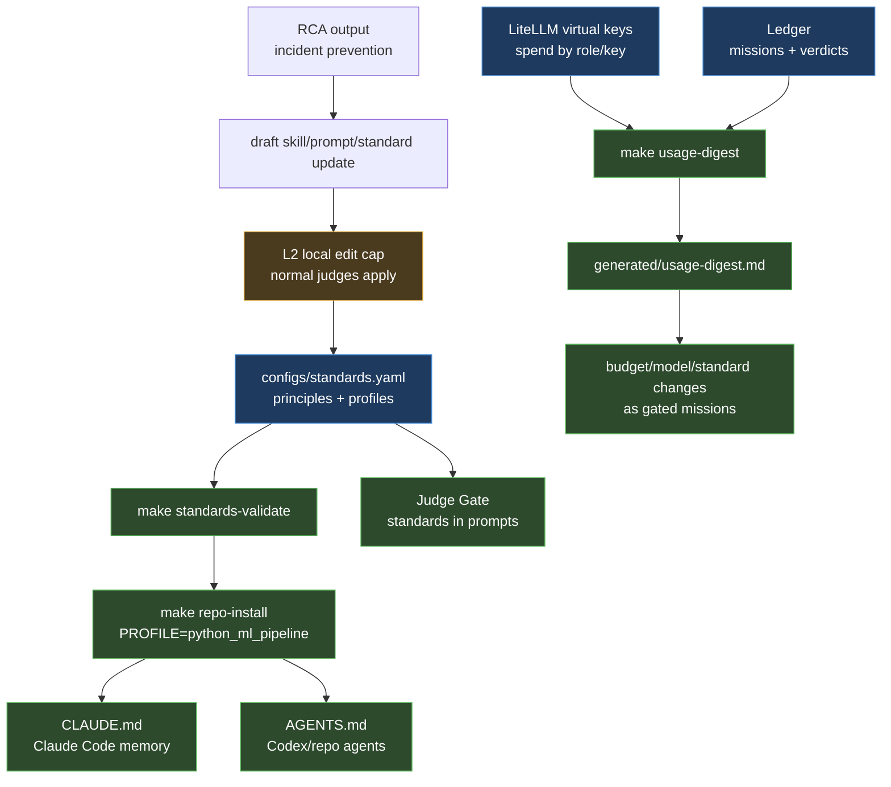

The feedback loop is automatic up to evidence and drafts, then gated for edits. Standards update once and render into both executors; usage spend is pulled from LiteLLM and operational behavior from the Ledger; skill/prompt improvements can be proposed by RCA, but cannot self-apply outside L2 gated work.
