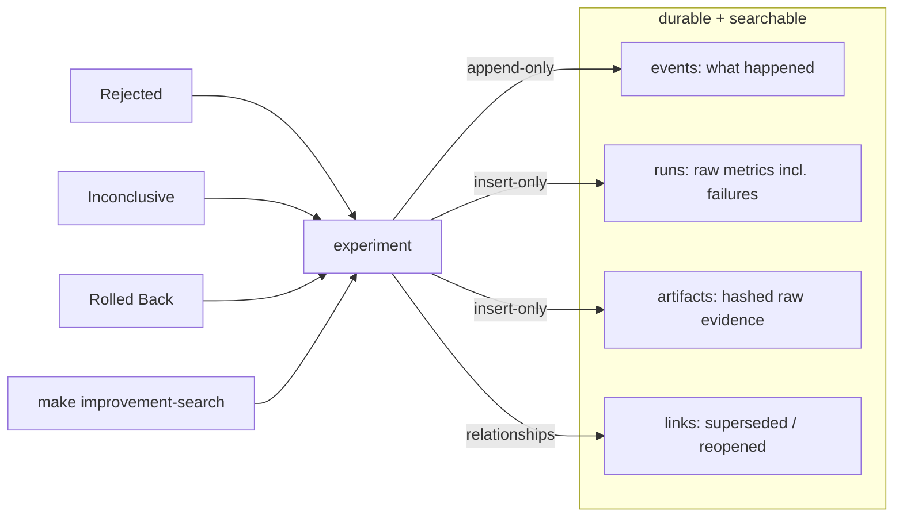

# The experiment registry (Ledger extension)

The improvement loop's state lives in the **same `ledger.db`** that already holds missions,
events, approvals, and leases — not a second database. The tables are additive
(`CREATE … IF NOT EXISTS`), so migrating an existing Ledger leaves the mission tables
untouched. **[implemented] [tested]** (`tests/test_experiment_registry.py`,
`tests/test_ledger_experiment_schema.py`).

## Schema

Canonical DDL: `src/command_center/improvement/ledger_schema.py` (`SCHEMA_SQL`). The Ledger
FastAPI service carries a byte-identical copy (it can't import the package); a drift test
fails if they ever disagree.

| table | purpose | write style |
|---|---|---|
| `experiments` | one row per experiment; the registered definition stored immutably as JSON | row + status changes also appended as events |
| `experiment_events` | lifecycle + execution audit trail | append-only |
| `experiment_runs` | one row per baseline/candidate/verifier run; raw metrics + budget kept | insert-only (FAILED/EXCLUDED retained) |
| `experiment_artifacts` | content-addressed evidence (path + sha256 + bytes) | insert-only |
| `experiment_links` | supersedes / reopened_from / related | insert-only |
| `schema_migrations` | which registry schema versions are applied | idempotent |

What is stored (mission §5): experiment metadata, mission ID, target + candidate versions,
baseline/candidate run IDs, **raw** metric results (not just a summary), budget consumption,
artifact locations + hashes, verification verdict, human decision, canary status, rollback
status, post-watch results, and superseded/reopened relationships.

## Structured events

`events.py` defines validated experiment events (`EXPERIMENT_REGISTERED`, `BASELINE_*`,
`CANDIDATE_*`, `BUDGET_WARNING/EXHAUSTED`, `DETERMINISTIC_GATE_FAILED`, `VERIFICATION_*`,
`HUMAN_PROMOTION_REQUESTED`, `CANARY_*`, `PROMOTED`, `ROLLED_BACK`, `POST_WATCH_COMPLETED`,
`EXPERIMENT_REJECTED/DEFERRED`) and execution events for credit assignment (`PLAN_CREATED`,
`HYPOTHESIS_CREATED`, `SOURCE_RETRIEVED`, `FILE_CHANGED`, `TEST_*`, `ROOT_CAUSE_IDENTIFIED`,
`PLAN_REVISED`, `IMPLEMENTATION_COMPLETED`, `SUMMARY_CREATED`). Each `EventRecord` carries
timestamp, mission/experiment id, actor role/model, action, input/output artifact hashes,
duration, token usage, estimated cost, exit code, error class, evidence links. **There is no
field for hidden model reasoning** — decisions, evidence, actions, outcomes only.

## Enforcement at the data layer

`ExperimentRegistry.set_status` is the **only** way an experiment's status changes, and it
changes only through `validate_transition`. That is what makes "no component promotes itself"
real in the data, not just the UI: `set_status(…, Canary, actor=AGENT)` raises before any row
is written. `promotion_conditions()` derives the gate booleans (deterministic-passed,
verification verdict, verifier independence, rollback demonstrated) from auditable Ledger
state — never from a model's say-so.

## Negative-result + decision memory

Every experiment — including `Rejected`, `Inconclusive`, and `Rolled Back` — stays in the
registry and is searchable (`registry.search`, `make improvement-search`). The immutable
definition records what was attempted and why; runs/artifacts record what evidence was
collected; the verdict and `post_watch.rollback_triggers` record why it passed/failed and
what would justify reopening; `experiment_links` records what superseded it.

## Migrations, backup, rollback

- `migrate(conn)` is idempotent and additive; tested against both a fresh DB and a DB that
  already holds the mission tables. **[tested]**
- **Backup**: the experiment tables ride inside the existing `ledger_data` Docker volume —
  the same `restic` snapshot / `make backup` that protects missions protects experiments.
- **Rollback of the migration itself**: because every statement is `CREATE … IF NOT EXISTS`,
  reverting is dropping the six experiment tables; the mission tables are unaffected.
