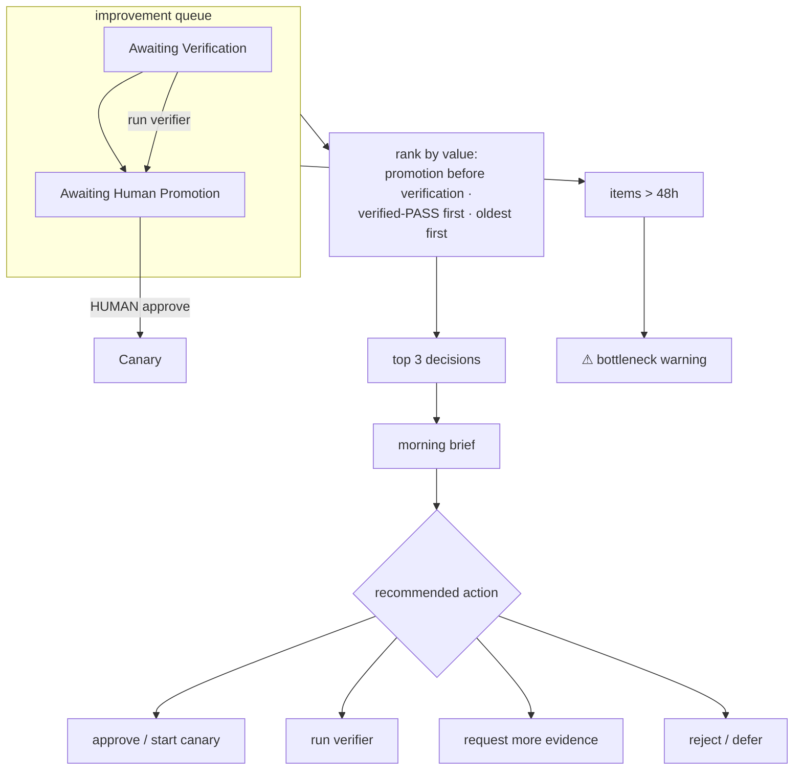

# Human-attention governance

The bottleneck in a supervised loop is not compute — it is the human who must approve, verify,
and promote. Human attention is treated as a constrained resource: measured, and compressed
into a morning brief that surfaces the few decisions worth making today **without hiding
uncertainty**. **[implemented] [tested]** (`src/command_center/improvement/attention.py`,
`tests/test_board_attention.py`).

## Metrics

`attention_metrics(registry)` reports: experiments awaiting verification, experiments awaiting
human promotion, median + p95 queue age, evidence volume per review, reviewer override rate,
post-approval regression rate, concurrent human decisions, and the percentage of generated
work that has been independently reproduced. `make attention-digest` prints the brief + the
metrics.

## The queue

## The morning brief

`morning_brief(registry)` emits, for the **three** highest-value decisions: the experiment,
its status + verifier verdict + risk, a **recommended action** (approve / run verifier /
request more evidence / reject / defer), evidence completeness (is a verifier report present?),
estimated review effort, and a path to the raw evidence. It then prints queue-health lines and
a bottleneck warning when items are stale (>48h) or 5+ experiments wait on human promotion. It
does **not** present fifty equal-priority items.

## Findings + recommended limits

From the demonstrated run the natural bottleneck is the **human-promotion** step (every
experiment converges there by design — that is the wall working). Recommended starting limits,
to be tuned against real queue data:

- **≤ 5 experiments in `Awaiting Human Promotion`** before the brief raises a bottleneck
  warning (already wired). **[implemented]**
- **48h** queue-age threshold for the stale-item callout. **[implemented]**
- Track `pct_independently_reproduced` — it should stay at **100%** (every promotion-eligible
  experiment has a verifier verdict); a drop means the verifier is being skipped. **[implemented]**

`cards awaiting approval`, `review time per mission`, and `reopened mission rate` are part of
the metric vocabulary but are sourced from the live Ledger missions / AppFlowy board; they are
populated when the running stack is reachable. **[blocked]**
