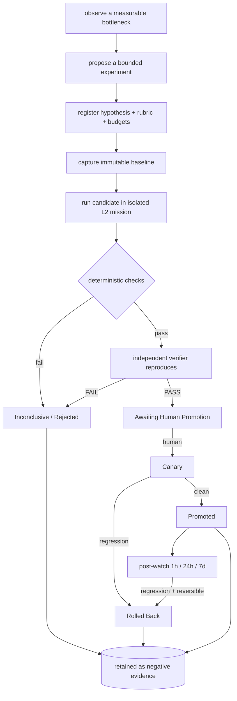
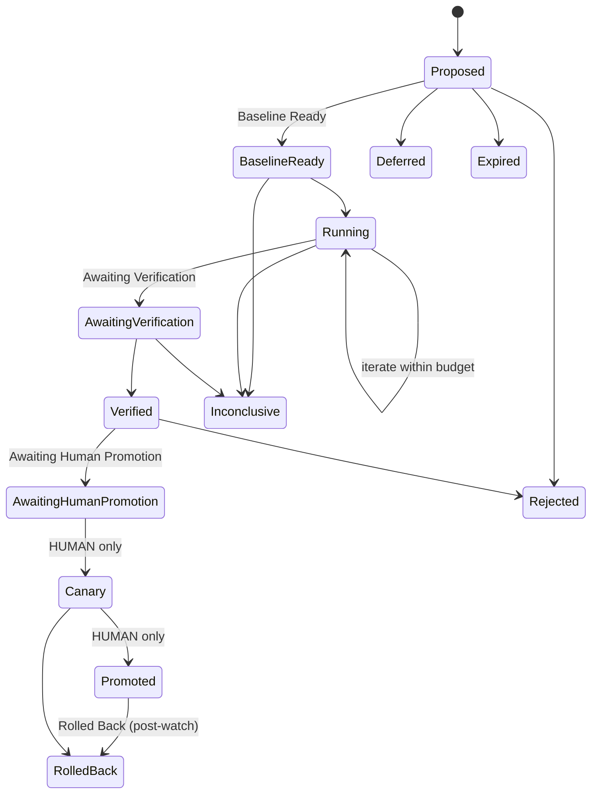
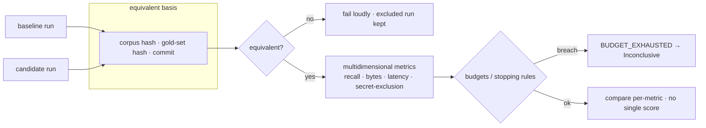
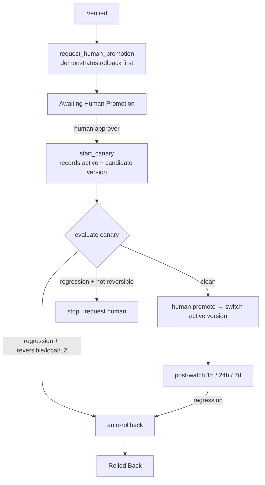

# The controlled improvement loop

A supervised engineering feedback loop layered **on top of** the existing command center —
the same Ledger, the same `configs/` + Pydantic contract pattern, the same gates, the same
human HMAC approval wall. It lets the system propose, run, independently verify, compare,
remember, and **recommend** improvements to its own prompts/skills/models/tools/routing/
judges/standards/workflows. It can never approve, promote, merge, deploy, or certify itself.

> **Status legend** — each claim below is tagged: **[implemented]** code exists ·
> **[tested]** a deterministic test exercises it · **[configured]** lives in a `configs/`
> file · **[planned]** designed, not built · **[blocked]** needs an external dependency ·
> **[human]** requires a human action by design.

## Where it lives

```
src/command_center/improvement/      the subsystem (lifecycle, registry, runner, verifier, …)
configs/improvement.yaml             experiment definitions (the source of truth)   [configured]
data/sealed-evals/                   access-controlled held-out eval content
data/calibration/                    labeled judge-calibration cases
services/ledger/app.py               experiment tables + REST live in the ONE ledger.db
src/command_center/cli/improvement.py  the operator CLI (make improvement-* / cc.ps1)
```

Nothing here is a second orchestrator, gateway, datastore, or approval mechanism. The
experiment tables are additive in the **same** `ledger.db`; promotion terminates at the same
human approval wall mission approvals use.

## The loop

**[implemented] [tested]** end to end (`tests/test_improvement_e2e.py`,
`evaluation/improvement-demo/run_demo.py` → `E2E-PROOF.md`).



## The lifecycle (one state machine for every target type)

**[implemented] [tested]** `src/command_center/improvement/lifecycle.py`,
`tests/test_improvement_lifecycle.py`. Target types (model, prompt, skill, judge, routing,
tool, retrieval, memory, standard, proactive_check, workflow, documentation,
repository_template) all share this path:



Two structural walls, enforced in `validate_transition` and re-asserted at the data layer
in `ExperimentRegistry.set_status`:

1. **[tested]** `Canary` and `Promoted` are reachable only by a **human** actor — an agent
   transition into them raises `HumanApprovalRequired`. No component promotes itself.
2. **[tested]** Entering `Awaiting Human Promotion` / `Canary` / `Promoted` requires the
   deterministic checks to have passed **and** an independent PASS verdict to be present.
   A model verdict can never override a deterministic failure.

## Baseline vs candidate (the runner)

**[implemented] [tested]** `runner.py`, `tests/test_experiment_runner.py`. The runner owns
the generic concerns; a per-target `Harness` does the measurement.



- Baseline locks on its first run (`baseline_locked`); a candidate run cannot change it. **[tested]**
- Failed / timed-out / excluded runs are recorded with their exact reason, never dropped. **[tested]**
- Raw stdout, metrics JSON, and the equivalence key are written to disk and hashed into the
  Ledger as artifacts. **[tested]**
- Budgets (iterations, wall time, tokens, cost, GPU, diff size) and stopping rules ("two
  iterations, no material improvement") halt the experiment; permissions/budgets are never
  auto-expanded to make it pass. **[tested]**

## Promotion, canary, rollback

**[implemented] [tested]** `promotion.py`, `tests/test_promotion.py`. The model pipeline's
pattern (canary → human tap → promote/rollback), generalized via a per-target adapter.



- Rollback is **demonstrated** (dry-run) before promotion, so the rollback edge is always
  real. **[tested]**
- Auto-rollback fires **only** when the rollback is reversible, local, and within the risk
  tier; otherwise it stops and asks a human. Never auto-roll-forward. **[tested]**
- Both old and new versions stay identifiable in the event log. **[tested]**

## Operator interface

**[implemented]** `make improvement-*` (Linux) and `.\scripts\cc.ps1 improvement-*`
(Windows) are equivalent. Write commands are **dry-run by default** and need `APPLY=1` /
`-Apply`; `canary` and `promote` additionally need an `APPROVER` and refuse to run as an
agent. See `make help` / `.\scripts\cc.ps1 help`.

```
make improvement-validate
make improvement-register ID=EXP-… APPLY=1 MISSION=T-…
make improvement-baseline ID=EXP-… APPLY=1
make improvement-run      ID=EXP-… APPLY=1
make improvement-verify   ID=EXP-… APPLY=1
make improvement-request-promotion ID=EXP-… APPLY=1
make improvement-canary   ID=EXP-… APPROVER=you APPLY=1   # human
make improvement-promote  ID=EXP-… APPROVER=you APPLY=1   # human
make improvement-rollback ID=EXP-… APPLY=1
make improvement-post-watch ID=EXP-… CHECKPOINT=24h APPLY=1
make improvement-board · judge-calibration · attention-digest · improvement-propose
```

## Target-type coverage

- **[implemented] [tested]** **All 13 target types** run end to end through the identical
  machinery — model, prompt, skill, judge, routing, tool, retrieval, memory, standard,
  proactive_check, workflow, documentation, repository_template. `retrieval` and `judge`
  have bespoke harnesses; the other 11 use deterministic harnesses in
  `harness_library.py` (each measures a real baseline-vs-candidate property over an inline
  fixture, candidate genuinely better, safety held). One reference experiment per type
  lives in `configs/improvement-targets.yaml`; `tests/test_all_target_types.py` drives
  every one register → … → Promoted (the agent-can't-promote wall holds for each).

## What is NOT live here

- **[tested, not in Docker]** The Ledger REST experiment endpoints are exercised live via
  FastAPI's TestClient (`tests/test_ledger_rest.py`), including the HMAC promotion wall — no
  running container needed; the container path is the same code.
- **[tested via fake client]** The Growth OS / AppFlowy board upsert is clobber-safe and
  tested with a fake client (`tests/test_growthos_board.py`); only the real network call to a
  reachable AppFlowy is env-blocked. The offline file board
  (`generated/improvements-board.json`) is the no-AppFlowy path.
- **[blocked]** Live **LLM-judge** calibration numbers need a reachable model. The scoring
  mechanism accepts a real judge's saved predictions (`improvement calibration --predictions
  …`, with confidence calibration) and is tested; the deterministic reference judge is the
  offline stand-in for the actual numbers.
- **[human]** Promotion and canary are human actions by design and always will be.

See also: `experiment-registry.md`, `independent-verification.md`, `judge-calibration.md`,
`human-attention-governance.md`, and the pre-work `improvement-loop-audit.md`.

## Daily scheduled proposal scan

**[configured] [planned]** The daily self-improvement scan is now a first-class
proactive contract: `configs/proactive.yaml` →
`self_improvement_scans.daily-self-improvement-brief`. Its Airflow wrapper is
documented in `daily-self-improvement-dag.md`.

This is only a proposal intake path. It scans Kanban, Ledger history, research
feeds, repo/code-health reports, dependency/model/provider signals, reliability
metrics, cost signals, and human-attention metrics; then it writes bounded
`Proposed` experiment cards plus one decision report. It does not run,
verify, approve, canary, promote, merge, deploy, or mark anything complete.
