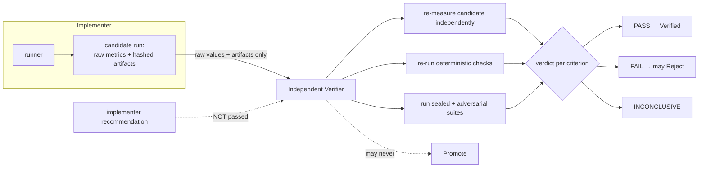

# Independent verification

Improve the system that performs the work **and** the system that checks the work. The
verifier is the second half. It is separate from the implementer by construction: it reads
the **raw** run values and artifacts and **re-measures** the candidate itself; it never reads
the implementer's recommendation or any persuasive summary. **[implemented] [tested]**
(`src/command_center/improvement/verifier.py`, `tests/test_verifier.py`).

## Generator vs verifier separation

## The walls

- **Self-verification is refused.** `verifier_identity` must differ from
  `implementer_identity`; equal identities raise `SelfVerificationError`. The config's
  `verification.independent_context` must be true and `allow_self_verification` false. **[tested]**
- **No safety criterion may pass as `INCONCLUSIVE`.** A safety criterion that can't be cleanly
  confirmed makes the whole verdict `FAIL`. **[tested]**
- **The verifier may reject, never promote.** On `PASS` it advances to `Verified`; on `FAIL`
  it may move to `Rejected`; it has no path to `Canary`/`Promoted`. **[tested]**

## Criteria (each PASS / FAIL / INCONCLUSIVE / NOT_APPLICABLE)

| id | checks | safety |
|---|---|---|
| C1 | independent reproduction of candidate metrics (deterministic metrics must reproduce **exactly**; timing tolerated) | |
| C2 | raw evidence retained, artifact hashes match, summary agrees with raw logs (catches omitted failures / doctored summaries) | |
| C3 | required metrics meet their bars on a **recompute** (not trusted from the implementer) | |
| C4 | no secret file ever surfaced — adversarial bait suite + secret-exclusion holds | **safety** |
| C5 | generalizes to a sealed held-out set (overfit smell: strong on visible, weak on held-out) | |
| C6 | the sealed set did not leak into the implementer's visible evidence | |
| C7 | candidate stayed within budget | |
| C8 | rollback is required and a trigger plan is defined (demonstrated at canary) | |
| C9 | the primary metric shows a statistically significant (FDR-controlled) improvement — recomputed independently | |

## Statistical rigor (Phase 0)

**[implemented] [tested]** `statistics.py` (pure stdlib — no numpy/scipy) gives the runner and
verifier trustworthy comparisons: percentile **bootstrap CIs**, **paired/unpaired** difference
tests, **Benjamini-Hochberg FDR** across the metrics tested, a **Sample-Ratio-Mismatch**
chi-squared check (invalidate at p < 0.001), and pre-registered **sample-size / MDE** power
analysis — plus an **A/A** helper that confirms the false-positive rate sits near α. Every
function is checked against closed-form values in `tests/test_statistics.py`.

Each candidate run carries a multidimensional `StatisticalReport` (per-metric CI + FDR
q-value + SRM + power), written as a hashed `statistics.json` artifact — never collapsed to
one score. The verifier **recomputes** it from the stored baseline samples and its own
re-measurement; criterion **C9** maps it to a verdict:

- `require_significance` off (the default) → **NA** (recorded as evidence, blocks nothing);
- SRM mismatch → **FAIL** (the baseline/candidate split is not what was intended);
- underpowered for the pre-registered MDE → **INCONCLUSIVE**;
- significant FDR-controlled win on the primary metric → **PASS**; else **FAIL**.

Like every criterion, C9 only gates eligibility / the reject path — it cannot promote.
Pre-register the plan per experiment via `statistics:` in `configs/improvement.yaml`
(`alpha`, `power`, `mde`, `test_type`, `primary_metric`, `guardrail_metrics`,
`require_significance`). It is optional and defaulted, so existing experiments validate
unchanged.

The "lying implementer" case is the point: a tampered candidate metric (claiming a result the
verifier cannot reproduce) trips C1 → verdict `FAIL` → `Rejected`. **[tested]**
(`test_lying_implementer_is_caught`). Tampered evidence trips C2. **[tested]**

## Sealed / adversarial / held-out evaluations

`configs/evals.yaml` carries eval **references** (id, category, description, version) visible
to everyone; the **content** lives under `data/sealed-evals/` and is loadable only by the
`verifier` / `eval-service` roles. **[implemented] [tested]** (`evals.py`,
`tests/test_sealed_evals.py`).

> This is filesystem + role **separation**, not cryptographic secrecy — we do not claim more
> than we implement. An implementer asking for sealed content raises `SealedAccessDenied`.

- Suites are pinned by `version`; changing a suite's content is its own experiment.
- `is_saturated(...)` flags a suite whose candidates all score at/above its threshold so it
  is rotated/retired rather than farmed forever. **[tested]**
- `scan_for_leakage(...)` detects a sealed query appearing verbatim in implementer evidence. **[tested]**

## Different model family

`verification.different_model_family_preferred` is a **preference**, not a guarantee, in this
deployment: the local judge array is single-provider Ollama, and the genuine cross-provider
pair is Claude Code ↔ Codex (the executors). The deterministic verifier used in the proof
runs as a distinct identity (`verifier:deterministic`) from the implementer (`runner`), which
is what the independence wall checks.
