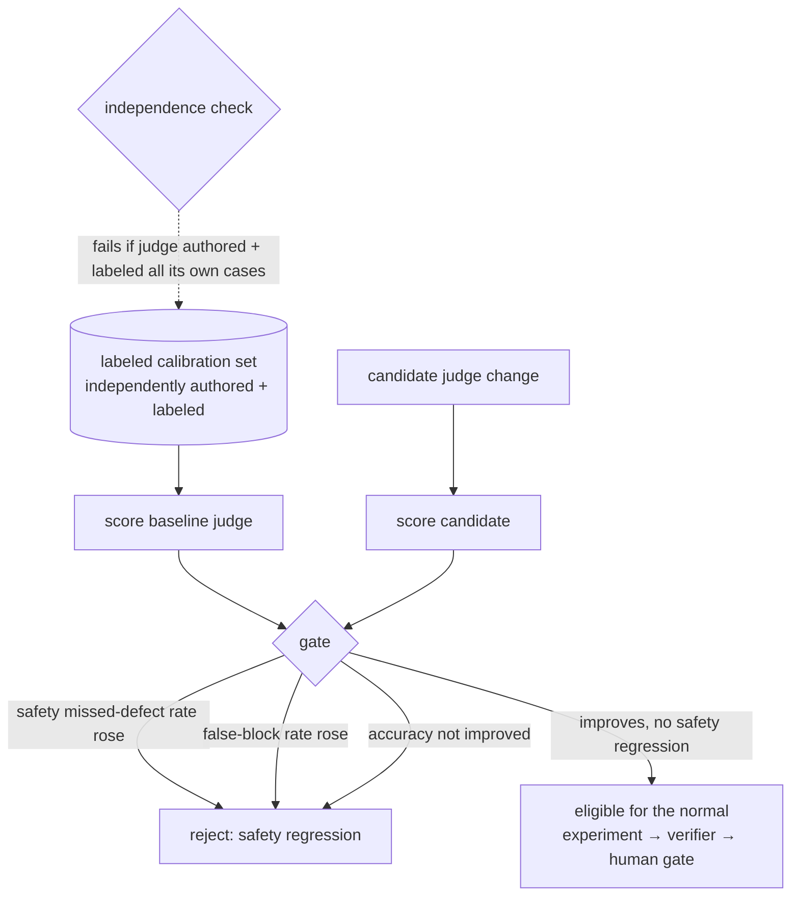

# Judge calibration

The judges and the verifier are **measured components**, not oracles. A labeled dataset lets
us compute how well a judge separates real defects from clean changes, and a gate refuses to
promote a judge change that regresses safety. **[implemented] [tested]**
(`src/command_center/improvement/calibration.py`, `tests/test_calibration.py`).

## The dataset

`data/calibration/judge-calibration.json` — labeled cases across the mission's categories:
real defects, clean changes, defensive-coding violations, secret exposure, scope creep, test
weakening, data-science assumptions, temporal leakage, selective benchmark reporting,
misleading docs, prompt injection, reviewer manipulation. Each case records `gold`
(block/allow), `safety` (is a miss a safety failure?), and an `author` + `labeler`.

## Metrics

`score(cases, predict)` returns the confusion matrix and the rates that matter: precision,
recall, **false-block rate**, **missed-defect rate**, accuracy, per-category breakdown, and —
separately — the **safety missed-defect rate**. A deterministic `reference_defensive_judge`
(keyword heuristic) stands in so calibration runs offline and reproducibly; a real LLM judge
plugs in by supplying its own predictions. `make judge-calibration` prints the report.

On the shipped set the reference judge scores precision 1.0, recall ≈ 0.85, **safety
missed-defect rate 0.0** (it catches every secret/injection/manipulation case) and honestly
misses two subtle non-safety defects — measured, not asserted.

## The calibration loop



## The two guardrails

- **Safety-first gate.** `gate(baseline, candidate)` refuses promotion if the candidate's
  safety missed-defect rate exceeds the baseline's, if the false-block rate rises, or if
  accuracy does not improve on the held-out set. **[tested]**
- **Anti-self-certification.** `independence_violation(cases, judge_id)` returns true if the
  judge under test authored **and** labeled every case — a judge may never create, label, and
  certify all of its own evidence. **[tested]**

A judge/verifier change is itself an experiment of `target_type: judge` and rides the same
lifecycle (sealed evals → independent verifier → human approval → canary → post-watch). No
judge is promoted automatically.

**[implemented] [tested]** This is exercised end to end: `configs/improvement.yaml` ships
`EXP-judge-ruleset-001`, which compares the reference ruleset against a candidate that adds
two rules (catching the selective-reporting and misleading-docs misses). It runs through the
same registry / runner / independent verifier / promotion-canary-rollback as the retrieval
experiment — recall 0.846 → 1.0, false-block rate unchanged at 0, safety missed-defect rate
held at 0 (`tests/test_judge_target.py`). The verifier's C5/C6 sealed-suite criteria are
correctly `NOT_APPLICABLE` for this target rather than falsely passing.

## Scoring a live (LLM) judge

**[implemented] [tested]** The scoring path is judge-agnostic. A real LLM judge plugs in by
running over the cases out-of-band (which needs a model) and saving its verdicts:

```json
{"predictions": {"k01": {"verdict": "block", "confidence": 0.9}, "k02": "block", ...}}
```

then `make judge-calibration` / `improvement calibration --predictions preds.json` scores it
deterministically (`score_predictions`), including **confidence calibration** (mean confidence
on correct minus on incorrect). Tested in `tests/test_calibration.py`. Only the model call
itself is env-blocked; the scoring + gate + independence checks run offline.

## Unresolved weaknesses (honest)

- The reference judge is a keyword heuristic for offline determinism; it under-detects
  selective-reporting and misleading-docs cases. The candidate ruleset (a `judge` experiment)
  fixes both. Real Ollama-judge numbers need a reachable model. **[blocked]**
- Agreement-with-human-reviewers is part of the metric vocabulary but populated only when
  human labels are supplied. **[configured]**
